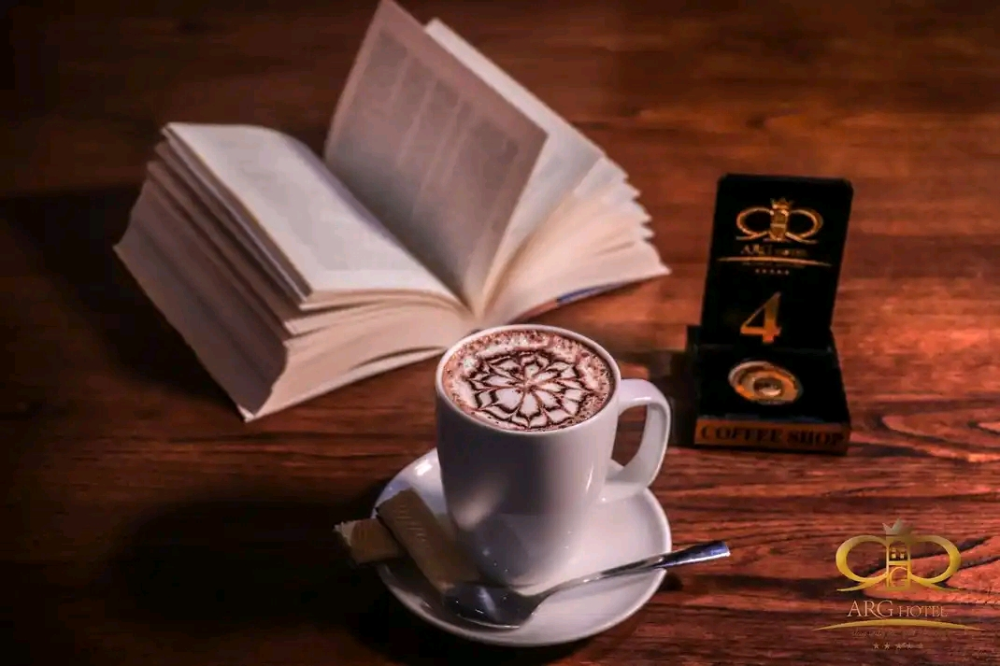

# ProductLandingPage 🚀

## Project Description 📝

> This project is created using HTML and CSS. It's a responsive webpage for coffee shop.

Examples:

- I created this project because it's a good idea for ptoduct landing page.
- I learned how to make responsive web disign.
- The information inside this project makes this it stand out because it can help to learn react.

```html
<div class="card">
      
      <p>Lorem ipsum dolor sit amet consectetur adipisicing elit. Earum totam, eum et inventore perferendis dolor amet soluta dignissimos! Deserunt reiciendis minus quo
      rerum modi, culpa quidem iusto deleniti veritatis aliquid!</p>
      <button type="submit">Shop</button>
    </div>
```

```css

.card {
  display: flex;
  flex-direction: column;
  justify-content: center;
  align-items: center;
  flex-wrap: wrap;
  width: 21%;
  padding: 10px;
  border: 1px solid saddlebrown;
  border-radius: 10px;
}

```


## Demo 📸


## Technologies Used 🛠️


- HTML
- CSS


## Usage 🎯

You can use this project simply by opening it in the browser.


## Features ⭐


- Building coffee shop page.

## Author 👩‍💻

Provide your name and a link to your Social Media profiles. You can also include your email address.

- LinkedIn: [Najeeba Qarqin](https://linkedin.com/in/Najeeba Qarqin)
- Email: [Email](najeebaqarqin@gmail.com)
